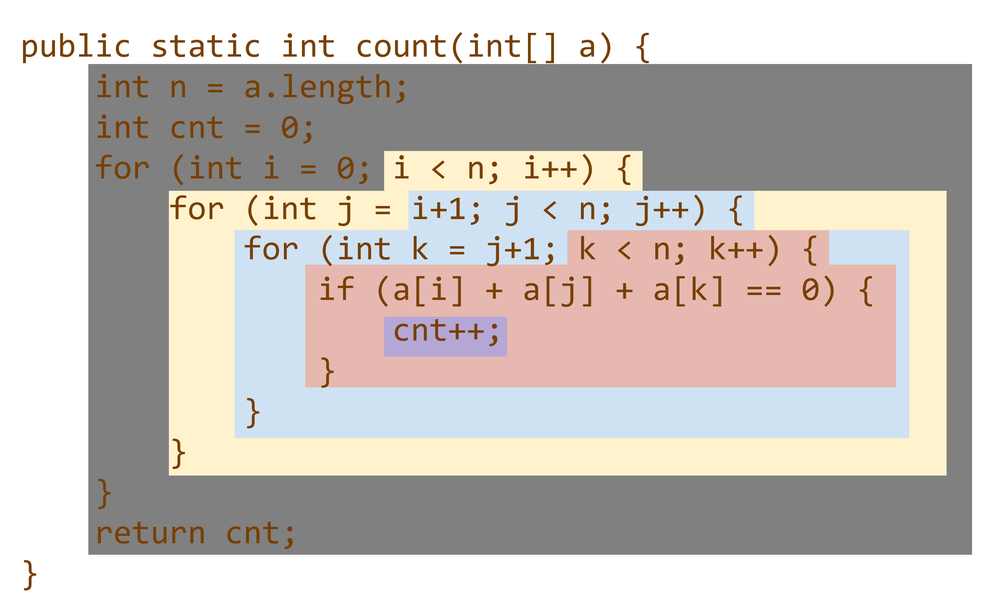
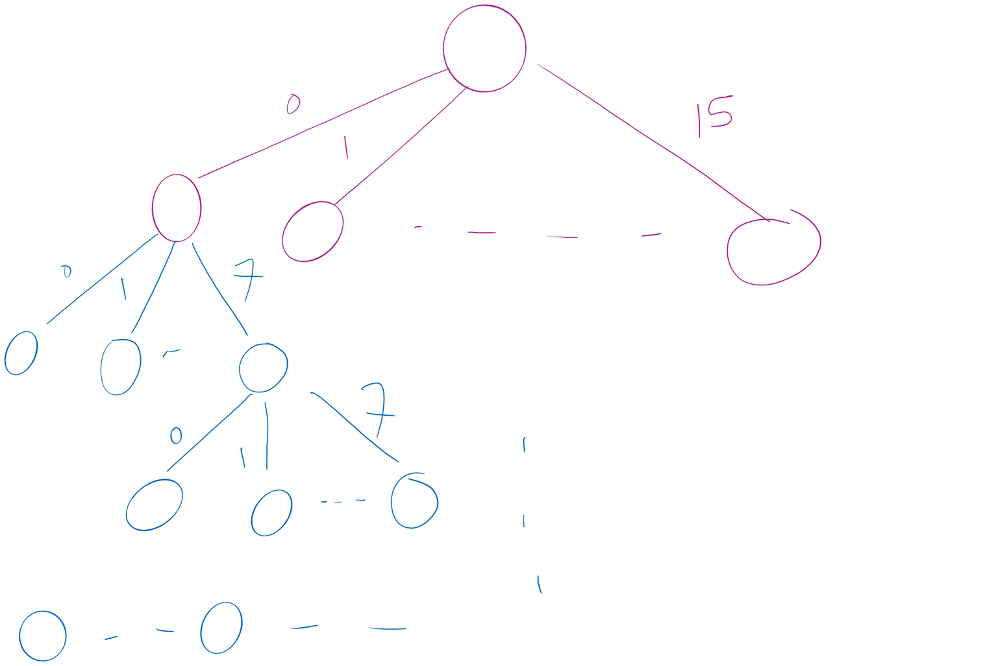

# Week 1: Intro Materials + Search, Pruning, Recursion, and Backtracking
## Modeling Runtime of Algorithms
### Example: ThreeSum Problem
Consider the ThreeSum Problem: Given a set of arbitrary integers find out how many **distinct** triples sum to exactly zero.

Before we begin, we must ask questions on the problem specifications such as: "*What does **distinct** mean in this problem?*", "*Is the data sorted?*", "*What is the input data size*", etc.

E.g., 
Example Input: 5, -1, 2, -3, -2, 1, 0.
For this set of inputs, our output should be 4 [(5, -2, -3), (-1, 0, 1,), (2, 0, -2), (-3, 1, 2)].

One possible solution is the **brute-force** solution: We enumerate all possible distinct triples and check their sums.
```PSEUDOCODE
cnt = 0
	for each distinct triple
		if sum of triple equals zero
			increment cnt 
```
Java Implementation:
```Java
public static int count(int[] a){
	int n = a.length;
	int cnt = 0;
	for (int i = 0; i < n; i++){
		for (int j = i+1; j < n; j++){
		// j loop starts from i + 1
			for (int k = j+1; k < n; k++){
				if (a[i] + a[j] + a[k] == 0){
					cnt++;
				}
			}
		}
	} return cnt;
}
```

Note that this is a valid solution only when the input integers are **distinct**. When the input integers are not distinct(*i.e, when there are duplicates*), `count(int[] a)` will find many solutions with the same values (because they are different instances of the same values). Therfore, we would need to chnage the defintion of the problem.

### Algorithm Analysis
How can we determine how much time it takes for this program to run? One way would be to write the program, compile, then run it to measure the *actual* run-time of the program on a given set of values. However, if the implementation is complicated (or time-consuming), we would be wasting time and money if we implemented it just to find out that the program's run-time is too long.

What if the algorithm is taking a really long time when running? Could we know if the algorithm is just really slow? or is there a bug in the program? 

Therefore, we want to to be able to predict the run-time of the program before or without actually running it. To do this, we can mathematically model the run-time using the method pioneered by [Donald Knuth](https://en.wikipedia.org/wiki/Donald_Knuth).

In the 1970s, Donald Knuth devised a way to calculate run-time using two factors:
1. **Cost** of executing each statement - determined by the machine used, environment running on the machine, etc.
2.  **Frequency** of execution of each statement - determined by program and input

In fact, we can model the run-time of algorithms using: $\sum_{\verb|all statements|}{\text{Cost}\times\text{Frequency}}$.
However, since our program might have a lot of statements, we can split the algorithm into blocks such that the code statements in each block have the same frequency: $\sum_{\verb|all blocks|}{\text{Cost}\times\text{Frequency}}$.

#### Example 1: Simple Loop
```Java
for(int i = 0; i < n; i++){
    a[i] = i;
}
```
The code can be divided into 3 blocks: `(i = 0;`, `i < n;`, and `i++) { a[i] = i; }`.
The first block(`i = 0`) runs only once at the start of the loop. The second block(`i < n`) runs $n+1$ times(because the comparison occurs one more time after the final interation of the loop); and the third inner block(`i++) { a[i] = i; }`) runs $n$ times.

#### Example 2: Loop with Conditional
```Java
if(x > 0){
    for(int i = 0; i < n; i++){
        a[i] = i;
    }
}
```
Now, the code can still be divided into 3 blocks: `if(x > 0)`, `for(int i = 0;`, and `i < n; i++) { a[i] = i; }`.

The first block (`if(x > 0)`) always executes once. The second block(`for(int i = 0;`) can run either once (if x > 0), or 0 times. The last block (`i < n; i++) { a[i] = i; }`) can run either 0 times, or $n$ times depending on the statement in the first block. (_Techincally,_ `i < n` runs $n+1$ times(if it runs), but the difference is minimal for large values of $n$; Thus, we can group them together for easier analysis).

Now, there is variation in the possible run-time: $1\times \text{Cost}_1$ or $1\times\text{Cost}_1+1\times\text{Cost}_2+n\times\text{Cost}_3$. I.e., we have a ***best-case*** run-time and a ***worst-case** run-time.

#### Example 3: Loop (i / 2)
```Java
for (i = n; i >= 1; i = i/2){
	a[i] = i;
}
```
There are two blocks in this code: `i = n` and `i >= 1; i = i/2){ a[i] = i; }`.
The first block (`i = n`) runs only once, at the start of the loop. The second block will run $\log_2{n}$ times.

### Improving ThreeSum Algorithm
So how can we use this knowledge to improve the ThreeSum problem? 
Let's first analyze our ThreeSum Algorithm:

| Block | Frequency | Cost |
|-------|-----------|------|
|Outer-Grey|$1$|$t_0$|
|Yellow|$n$|$t_1$|
|Blue|$\frac{n^2}{2}−\frac{n}{2}$ <sup>1</sup>|$t_2$|
|Red|$\frac{n^3}{6}-\frac{n^2}{2}+\frac{n}{3}$<sup>2</sup>|$t_3$|
|Purple|$x$ <sup>3</sup>|$t_4$|
<sup>1</sup> $(n-1)+(n-2)+(n-3)+...+1=\frac{n-1}{2}(n-1+1)=\frac{n^2}{2}-\frac{n}{2}$
<sup>2</sup> $C(n,3)=\frac{n!}{(n-3)!3!}=\frac{n^3}{6}-\frac{n^2}{2}+\frac{n}{3}$ 
<sup>3</sup>  $x:=\text{the number of triples that sum to 0 in the input array};\ \text{for}\ 0\leq x \leq C(n,3)$

Thus the total run-time is $\sum_{i=0}^{4}f_i\cdot t_i= \frac{t_3}{6}n^3+(\frac{t_2}{2}-\frac{t_3}{2})n^2 + (\frac{t_3}{3}-\frac{t_2}{2}+t_1)n+t_0+t_4 x$. 

Recall the bounds for $x$ ($0 \leq x \leq C(n,3)$) which means:
1) Best-case: $x=0$ $$\frac{t_3}{6}n^3+(\frac{t_2}{2}-\frac{t_3}{2})n^2 + (\frac{t_3}{3}-\frac{t_2}{2}+t_1)n+t_0$$
2) Worst-cast: $x=C(n,3)$$$\frac{t_3}{6}n^3+(\frac{t_2}{2}-\frac{t_3}{2})n^2 + (\frac{t_3}{3}-\frac{t_2}{2}+t_1)n+t_0+t_4(\frac{n^3}{6}-\frac{n^2}{2}+\frac{n}{3})$$
### Asymptotic Analysis
Notice that  our result from above is really ugly and we don't always want to consider all the terms and constants. So instead, we can use **Asymptotic Analysis**. To do this, we must:
1) determine _resource usage_ as a function of _input size_, as we did in ThreeSum.
2) Then, we measure the **_asymptotic_** performance (i.e., the performance as input size increases to infinity).

Specifically, we want to focus on the **order of growth** of functions, not on exact values. What is *order of growth*? It captures how fast the function values increases when the input increases; in particular for a function $T(n)$.
	For example, we want to know: *when $n$ doubles, does $T(n)$ essentialy*: stay constant? increase by a constant? double? quadruple? increase eightfold? etc.
We don't really care as much about the exact value of $T(n)$.
	Note we use $T(n)$ instead of $f(x)$ because $T$ stands for (running) time and $n$ signifies that the input is a positive integer.

Some common orders of growth we will use is:
| Orders of Growth | Meaning |
|------------------|---------|
|$1$|Constant: Run-time does not depend on input size|
|$\log_2(n)$ or $\log(n)$ | Logarithmic: The number of times $n$ can be divided by $2$ before we reach $1$ or less|
|$n$|Linear: Run-time grows proportional to input size|
|$n\log(n)$| Linearithmetic|
| $n^2$|Quadratic|
|$n^3$|Cubic|
|$2^n$|Exponential|
|$n!$|Factorial|

For run time fuctions, we want to have a low order of growth. _I.e.,_ we want the run-time to increase less when the input size increases(=a fast algorithm).

To actually do asymptotic analysis, we simply:
1) Ignore lower-order terms
2) Ignore multiplicative constants

This is a gross simplification of  asymptotic analysis, and while it works for most of the algorithms in this course, it might be more difficult for some real-life algorithms. As a result, sometimes it may be difficult to determine the highest-order term. Also, sometimes the constant factors do play a significant role (*e.g.,* small or medium-size input or large constant factors).


#### Example: $T(n)=5n^3+53n+7$
In $T(n)=5n^3+53n+7$ the terms are $5n^3$, $53n$, and $7$. Since the order of $5n^3$ is $3$, $53\ n$ is $1$, and $7$ is $0$, we can conclude that $5n^3+53n+7 \to n^3$.

#### Big O Notation Family
However, mathematically we can't say $5n^3+53n+7=n^3$. Instead we need a special mathematical notation, the big-O notation: $5n^3+53n+7=O(n^3)$. It means the order of growth of $5n^3+53n+7$ is no more than ($\leq$) the order of growth of $n^3$.
	Note that $f(x)\in O(g(x))$ and $f(x)=O(g(x))$ are both valid notation-wise and mean that $f(x)$ is $O(g(x))$.
Also, since the big-O notation defines the maximum possible(inclusive) order, $\log n\in O(n)$ because $\log n < n$.

Some other notations are:
- $o:<$ (little o or O-micron),
- $\Omega: \geq$ (Big Omega)
- $\omega: >$ (little omega)
- $\theta:=$ (Theta) — is only used for most optimal algorithm

You must be careful when you ignore constants. For example, it doesn't matter asymptotically between {$n$ and $n+1$}, or {$n$ and $2n$}, but the difference between {$2^n$ and $2^{2n}$} is significant asymptotically.

#### Asymptotic Approximation of Common Series
$$\verb|Arithmetic Series|=1+2+3+4+...+n=\#terms(\frac{\verb|term|_{first}+\verb|term|_{last}}{2})=\theta({\#terms\cdot\verb|largest term|})$$
$$\verb|Geometric Series|=1+2+4+8+16+...=\theta(\verb|largest term|)$$
#### Example: ThreeSum
Recall our run-time: $T(n)= \frac{t_3}{6}n^3+(\frac{t_2}{2}-\frac{t_3}{2})n^2 + (\frac{t_3}{3}-\frac{t_2}{2}+t_1)n+t_0+t_4 x$, we can now use asymptotic analysis to simplify this into: $T(n)=O(n^3)$.
	Note that this also means $T(n)\in O(n^4), O(n^5),$ and $O(3^n)$.

### Sidenote: ~ Notation
Tilde Approximation(~) is another mathematical notation which is very similar to $\theta$. However, the tilde keeps the constant factors. So, two functions are tilde of each other if they have the same order of growth and the same constant of the largest term.
*E.g.,* $5n=\theta(5000000000n)\neq \sim 5000000000n$.

### A Faster Algorithm for ThreeSum
So what if we sorted the array first? *I.e.,* we pick two numbers, then binary serach for the third one that makes the sum zero.

*E.g.,* `a[i] = 10` and `a[j]=-7`, so we binary search for `-3`

Notice that we will still have the two for-loops, but we replaced the third one with binary search.This makes the run-time $n^2\cdot\log_2{n}$. However we must account for the time it took to sort: $n\log_2{n}$ (best case). So in total, we get:$$n^2\log_2{n}+n\log{n}$$
Thus asymptotically, we have an algorithm that is $O(n^2\cdot\log_2{n}$)

### An Even Faster Algoirthm for ThreeSum?
- Yes, there is actually a $O(n^2)$ solution.
	- We could use hashing to find the third number, but it requires populating the has table.
	- We coud select a number, and find a pair in linear time.
- There is also a $O(n\log_2{n})$ solution for special cases.
- However, we don't know if there is a $O(n^{2-\varepsilon})$ algorithm for some $\varepsilon>0$.

## Backtracking, Recursion, and Pruning
### Problem: Boggle

Let's consider another problem: Boggle. Given a 4x4 board of letters, we want to find all words with at least 3 adjacent letters.
- Adjacent letters are horizontally, vertically, or diagonally neighboring
- Any cube in the board can only be used once per word, but can be used fo multiple words

Let's begin by using recursion. In our first choice, we have 16 different options to start from. Then, we have 8 different options from each cube. From `B[i][j]`, we have:
1.  `B[i-1][j-1]`
2.  `B[i-1][j]`
3.  `B[i-1][j+1]`
4.  `B[i][j-1]`
5.  `B[i][j+1]`
6.  `B[i+1][j-1]`
7.  `B[i+1][j]`
8.  `B[i+1][j+1] `

There is a decision to make at each cube that we go through: a maximum of 15 decisions, but some decisions may be trivial if the number of choices is 0.


This is called the search space.

At first, all 16 choices are valid. But for the next decision, the some of the 8 choices may not be. That's because 1) we can’t go past the edge of the board 2) we can't reuse cells, or 3) each letter added must lead to the prefix of an actual word.

So, we don't necessarily have to *try all choices.* For example, if we check the dictionary as we add each letter, if there is no word with the currently constructed string as a prefix, don’t go further down this way. Practically, this can be used for huge savings; and this process is called **pruning**.

So how do we implement such **exhaustive search** with **pruning**? We can use **backtracking**.
### Backtracking Framework
Many backtracking algorithms can be implemented by using the following framework:
```PSEUDOCODE
void traverse(current decision, partial solution) {
   for each choice at the current decision {
       if choice is valid {
          apply choice to partial solution
          if partial solution a valid solution
             report partial solution as a final solution
          if more decisions possible
             traverse(next decision, updated partial solution)
           undo changes to partial solution
        }
     }
}
```

#### Applying the Framework to Boggle
1. `void traverse(current decision, partial solution) {`
	1. `current decision` holds which cube we are at: row number & column number
	2. `partial solution` holds the letters we have seen so far
2. `for each choice at the current decision {`
	1. We have 8 choices as we have seen above
3. `if choice is valid {`
	1. Invalid choices send us outside the board, reuse a cube, or result in a non-prefix
4. `apply choice to partial solution`
	1. Append the letter to the partial solution and mark the cube as used
5. `if partial solution a valid solution, report partial solution as a final solution`
	1. If the partial solution is a 3+ letter word in the dictionary, return
6. `more decisions possible, traverse(next decision, updated partial solution)`
	1. A decision is possible if partial solution is a prefix of a word in the dictionary,
	2. So we make a recursive call. Next decision is the next cube down the direction that we chose
7. `undo changes to partial solution`
	1. Remove the last letter that we appended from partial solution and mark cube as unused