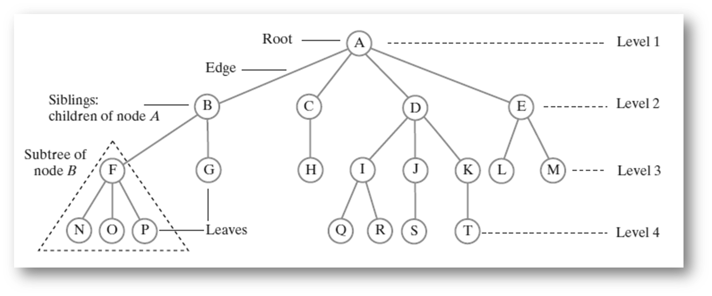
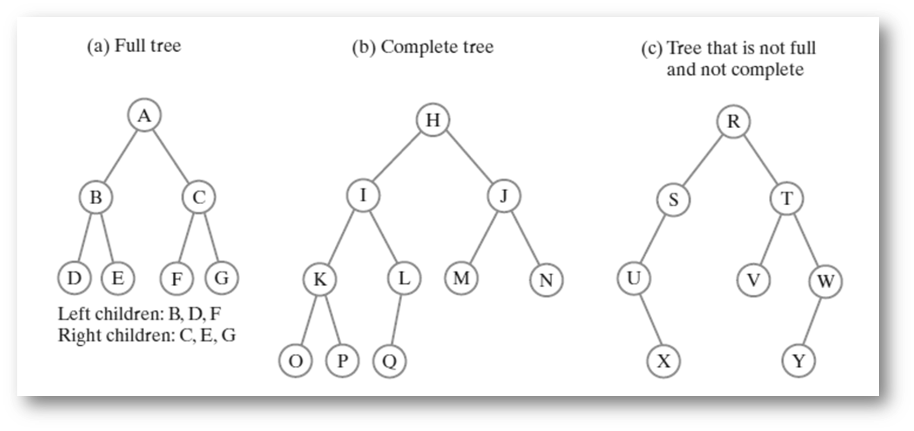

# Week 2: Search Problem, ADT Tree
## Recap: Boggle Game
Recall the Boggle Game. Given a 4x4 board of letters, we want to find all words with at least 3 adjacent letters.
- Adjacent letters are horizontally, vertically, or diagonally neighboring
- Any cube in the board can only be used once per word, but can be used fo multiple words

We came up with the pseudocode to solve the boggle game:
```Pseudo
void traverse(row and column of current cell, word string so far) {
   for each of the eight directions {
       if neighbor down the direction is a in the board and hasn’t been used {
          append neighbor’s letter to word string and mark neighbor             
          as used
          if word string a word with 3+ letters
             add word string to set of solutions
          if word string is a prefix
             traverse(row and column of neighbor, word string)
           delete last letter of word string and mark neighbor as unused
        }
     }
}
```

We also discussed how the search space could be modeled as a *tree*. In this tree, each node represents one call to `traverse()` except the root node.

Notice that with recursive algorithms, it is difficult to determine the the run-time using the frequency and cost technique due to the recursive calls. 

However, we know that in the worst case, the backtracking algorithm must visit each node in the search space tree. And at each node, the non-recursive part of traverse executes. So, we can use the number of nodes in the search tree as a lower bound for the worst-case runtime: $\text{worst-case runtime}=\text{number of nodes} \times \text{work per node (non-recursive part of traverse)}$

#### Calculating the Number of Nodes
So let's first calculate the number of nodes.

**Maximum Number of Nodes** (Worst Case) $= 1 +16 \times (1+8+8^2+8^3+...+8^{15})$
We can use theta($\theta$) notation to simplify: Maximum Number of Nodes = $1+\theta(\text{largest term})=1+16\times\theta(8^{15})$.

In terms of board size($n$), we get: **Maximum Number of Nodes**$=1+n\times\theta(8^{n-1})=\theta(n\times 8^{n-1})=\theta({n\times 8^n})$  

Thus, in the worst-case, the run-time of backtracking for Boggle is $\Omega(n\times 8^n)$, where $n$ is the board size (number of cells). If the non-recursive work is constant ($O(1)$), then the worst-case runtime would be $O(n\times 8^n)$. Clearly, the worst-case runtime of backtracking algorithm is exponential. (Although **pruning** has practical savings in runtime, the runtime is still exponential).

### Speeding Up the Non-Recursive Work
So how can we make the non-recursive work(dictionary lookup for prefix/words) faster ($O(1)$)? There are many things we could do such as using a hash table, or a *tree*, but first let's discuss the time needed to append and delete letters from the word string.
#### String v. StringBuilder
When we are constructing the words over the course of recursion, we will need to build up / tear down strings. When we move down the tree, we are adding a new character to the current string. When we bactrack, we must remove the most recent character. (Think pushing/popping a string stack).

If we use a stack, `push` and `pop` are generally $\theta(1)$ except when we need to resize. However, that cost can be **amoritzed**.

So how could we implement this? We could *try* using a `String` to hold the current word string. However, Java `String`s are immutable which means everytime we make changes to the `String`, it must create a new object and allocate it to the variables which makes it essentially $\theta(n)$ where $n$ is the `length()` of the String.
```Java
s = new String("Here is a basic string");
s = s + "this operation allocates and initializes all over again";
```

So using a `String` is not a good idea, but we can use the `StringBuilder` to overcome this. `append()` and `deleteCharAt()` can be used to `push` and `pop` which now runs at $\theta(1)$. However, we still need to account for resizing (we must amortize it).
	- Note that the `StringBuffer` can also be used for this purpose. The `StringBuffer` is synchornized while the `StringBuilder` is not

## Searching Problem
A common problem in computer science is the searching problem. If we have:
+ a large *dynamic* set of data items in the form of `(key, value)` pairs
	+ Dynamic means we can add or remove from the set
+ input size($n$) for the number of pairs
	+ with key size assumed constant
We want to see if the *target key* exists in the set or not. If the key is not found, we can return `NULL`, `false`, or some other value to signify that key was not found.

### Symbol Table ADT
To solve this problem, we are going to create a new abstract data type, which we will call the **Symbol Table ADT**. Our ADT has a set of (key, value) pairs and the operations: `insert`, `search`, `delete`. Its name comes from earlier use in compilers.

We can implement the symbol table using: **Unsorted Array**, **Sorted Array**, **Unsorted LinkedList**, **Sorted LinkedList**, **Hash Table**.
|Implementation|Runtime for Insert|Runtime for search|Runtime for delete|
|------------------------------|---------------------------------------------|-------------------------|-------------------------|
|Unsorted Array|$O(1)$ - Insert at end (Amortized)|$O(N)$ - Linear Search|$O(N)$ - $O(N)$ to search for the element, then shift if necessary (Amortized)|
|Sorted Array|$O(N)$ - Find correct place, then shift|$O(\log{N})$ - Binary Search|$O(N)$ - Binary Search, then shift if necessary|
|Unsorted Linked List|$O(1)$ - Add at front|$O(N)$ - Linear Search|$O(N)$ - Linear Search|
|Sorted Linked List|$O(N)$ - Linear Search|$O(N)$ - Linear Search|$O(N)$ - Linear Search|
|Hash Table|Average: $O(1)$|Average: $O(1)$|Average: $O(1)$|

## Tree ADT
Arrays and LinkedLists are linear structures, but what if we used a non-linear data structure like a **tree**?

A **Binary Tree** is a tree where each node has at most 2 children.

A **full binary tree** is a tree in which every node other than the leaves has two children. A **complete binary tree** is a binary tree in which every level, except possibly the last, is completely filled, and all nodes are as far left as possible. So all full trees are complete binary tree.

Note that the number of nodes in a full tree is: $1+2+4+8+...=\sum_{i=0}^{h-1}2^i=\theta(2^{h-1})$ where $h$ is the height of the tree. This also implies that a complete tree has at maximum of $\theta(2^{h-1})$ nodes.

### Implementing a Tree
Let's first declare our Tree as a (generic) interface:
```Java
public interface TreeInterface<T> {
	public T getRootData() throws EmptyTreeException;
	public int getHeight() throws EmptyTreeException;
	public int getNumberOfNodes() throws EmptyTreeException;
	public boolean isEmpty();
	public void levelOrderTraverse();
	public void clear();
}
public class EmptyTreeException extends Exception {
	public EmptyTreeException(String reason){
		super(reason);
	}
}
```
#### Binary Tree Implementation
```Java
public interface BinaryTreeInterface<T> extends TreeInterface<T> {
	public void buildTree(T rootData); //Build a tree with just one root
	public void buildTree(T rootData, BinaryTreeInterface<T> left, BinaryTreeInterface<T> right); // Build a tree with root, left subtree, and right subtree
}
```
We'll first implement the Binary Tree using a linked structure. We'll have a pointer to a root node, and each node will point to the next node. So first, let's define the node:
```Java
public class BinaryNode<T> {
	private T data; // Points to Data
	private BinaryNode<T> left;  // Points to left node (root of left subtree)
	private BinaryNode<T> right; // Points to right node (root of right subtree)
	/*
	* Construcor (Default)
	*/
	public BinaryNode(T data){
		this(data, null, null);
	}
	/*
	* Construcor (Parametized)
	*/
	public BinaryNode(T data, BinaryNode<T> left, BinaryNode<T> right){
		this.data = data;
		this.left = left;
		this.right = right;
	}
	/*
	* Setters and Getters
	*/
	public void setData(T data){
		this.data = data;
		}
		
	public T getData(){
	    return data;
	}
	
	public void setLeftChild(BinaryNode<T> left){
		this.left = left;
	}
	
	public BinaryNode<T> getLeftChild(){
		return left;
	}
	
	public void setRightChild(BinaryNode<T> right){
		this.right = right;
	}
	
	public BinaryNode<T> getRightChild(){
		return right;
	  }
	/*
	* Check if it has childs
	*/
	public boolean hasLeftChild(){
		return left != null;
	}
	
	public boolean hasRightChild(){
		return right != null;
	}
	/* How do we get the number of nodes?
	 * 1. Traverse & Count all nodes
	 * 2. Use recursion on the subtree.
	 */
	public int getNumberOfNodes(){
		int result = 1;
		if(left != null){
			result += left.getNumberOfNodes();
		}
		if(right != null){
			result += right.getNumberOfNodes();
		}
		return result;
	}
	// Similarly, use recursion
	// Another way to implement is to parameterize the rootNode and pass in the children
	public int getHeight(){
		int max = 0;
		if(left != null){
			max = left.getHeight();
		}
		if(right != null){
			if(right.getHeight() > max){
				max = right.getHeight();
			}
		}
		return 1 + max;
	}
	// Again, recursion
	public BinaryNode<T> copy(){
		BinaryNode<T> newRoot = new BinaryNode<>(data);
		if(left != null){
			newRoot.left = left.copy();
		}
		if(right != null){
			newRoot.right = right.copy();
		}
		return newRoot;
	}
}
```
