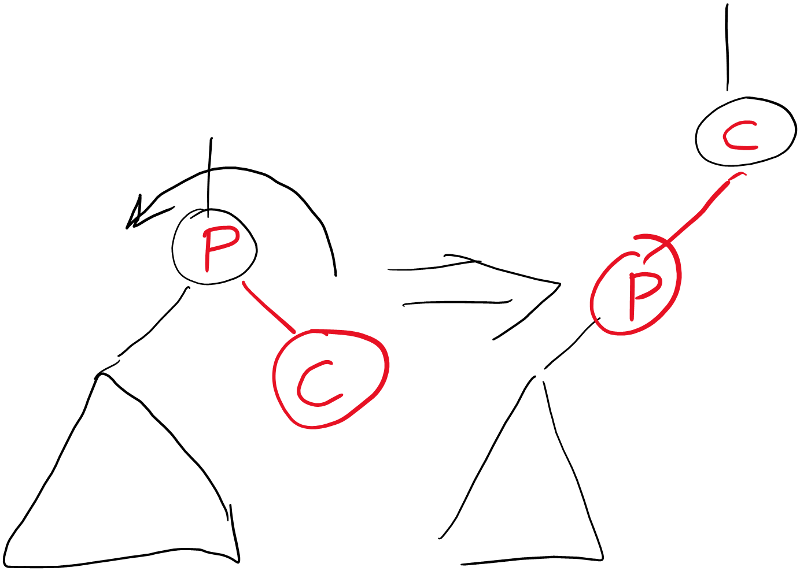
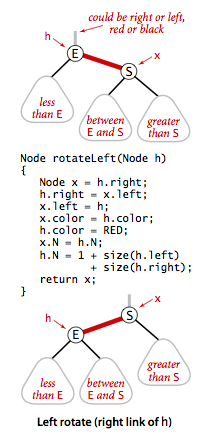
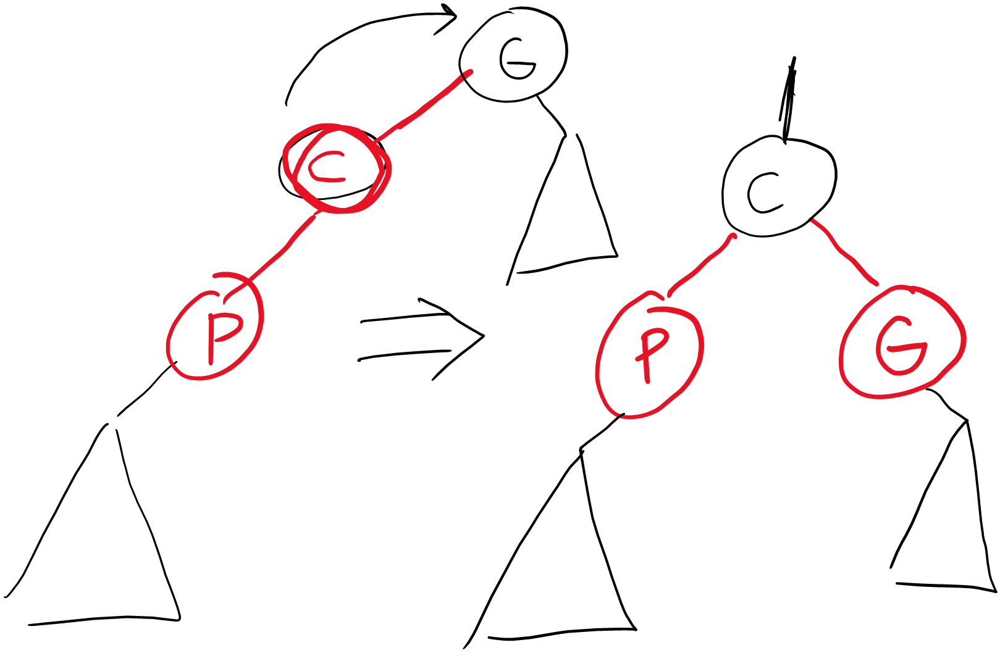
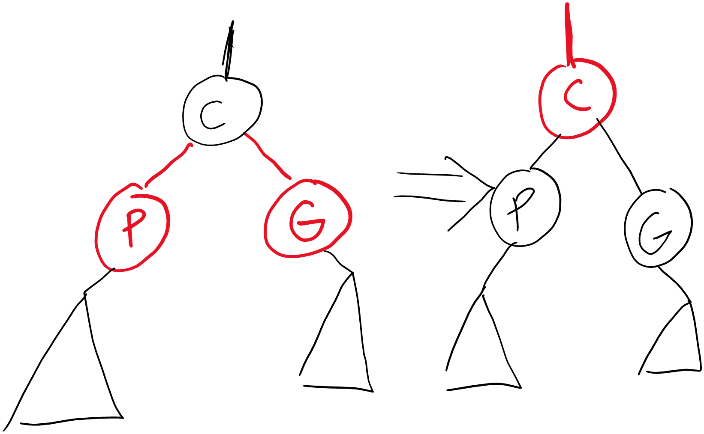
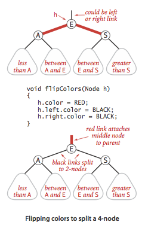

# Week 4: Self-Balancing Trees
## Red-Black BST (Balanced BST)
We have seen that the worst-case runtime of a binary tree is $O(n)$. However, is there a way to make the worst-case runtime to be $O(\log n)$? The answer is yes. We can do so if we keep the tree **balanced**, that is, keep the difference in height between left and right subtrees in control.

One way to do this is using the **Red-Black BST**. In a Red-Black BST:
+ Edges have two colors: either red, or black.
+ Node takes the color of the edge to its parent
+ Only left-child edges can be red (In Left-leaning RB-BST only)
+ At most one red-edge is connected to each node
+ Each leaf node has two black null-edges out of it (references to null)
+ All paths from root to null-edges must have the same number of black edges
+ Root node is black
Doing this will ensure that the maximum height is $2\log(n)$ This will make our run-time $O(\log n)$. Additionally, to implement a Red-Black BST, it will have the following operations:
+ Rotate Left
+ Rotate Right
+ Flip Color
Note that a fully-black binary tree is still a RB-BST, as long as it is a full tree—this ensures that the root-to-null black length is the same throughout.
### Adding to RB-BST
When we add a new node, we will color the new node to be red. This is because if we add a black node, the root-to-null-leaf paths number will be changed (assuming the original RB-BST is valid).

However, we need to take into consideration other restrictions of RB-BST. If the new node is right child, we must fix it to make sure the red edge is not on the right node. If the parent of the new node is also red, we must fix it to make sure no node has two red edges. Lastly, if the sibiling of the new node is red, we must fix it to make sure no node has two red edges.

#### Case 1: New Node is Red Right Node
Assuming that sibling of new node is black, if the new node we add is a right child, we can use the use the `rotateLeft` operation. If the sibling of the new node is also red, we will handle it in Case 3.


#### Case 2: Parent of the New Node is Red
If the parent node is red, making it RedEdge-ParentNode-RedEdge, we can use the `rotateRight` operation.


#### Case 3: Sibling of the New Node is Red
If the sibiling of the new node is red, the restrictions of RB-BST is still violated because there are 2 red edges to the parent node. In this case, we can flip the colors, turning the 2 red edges into black, and then the parent-grandparent edge into red. However, doing this may cause violations in the next level up. This will mean that we need to correct the violations as we climb back upto the root.

#### Summary
In Summary, a new node is always red (at least initially). However, if the properties are violated, we can correct them using one or more of the basic operations. But we must recognize that correcting a violation may result in a violation in a upper level of the tree. We can implement this using the recusion, as we climb back up the tree, meaning we should correct after the recursive call.

So, which correction should we deal with first? We must first recognize that there are dependencies between the corrections. Given a valid RB-BST, we must:
1. Check for right-red edge case
2. Check for Red-Parent-Red case
3. Check for Two-Red-Siblings case
```Java
private Node put(Node h, Key key, Value val) { 
	if (h == null) return new Node(key, val, RED, 1);
	
	int cmp = key.compareTo(h.key);
	if      (cmp < 0) h.left  = put(h.left,  key, val); 
	else if (cmp > 0) h.right = put(h.right, key, val); 
	else              h.val   = val;
	
	// fix-up any right-leaning links
	if (isRed(h.right) && !isRed(h.left))      h = rotateLeft(h);
	if (isRed(h.left)  &&  isRed(h.left.left)) h = rotateRight(h);
	if (isRed(h.left)  &&  isRed(h.right))     flipColors(h);
	h.size = size(h.left) + size(h.right) + 1;
```
Notice that we take care of violations after all the recursive calls. This is because we wish to fix them *as we go up the tree*.

### Deleting from RB-BST
To delete from a RB-BST, we must first make sure that we are not deleting a black node. That means, as we go down the tree, we need to make sure that the next node down is red (which can be done using a variety of operations). Then, as we go back up the tree, we must correct any violations. If we are deleting a node with 2 children we need to:
1. replace with minimum of right subtree
2. delete minimum of right subtree
(similar to deleting in regular BST)

### Other BST Operations
A BST has more operations than we've previously discussed. For example, we can find the sucessor or the predecessor of an item. We can find all items within a specific range. The code for these other operations are identical to the BST, which means their worst-case runtime is $O(\log n)$. 

## Aside: Recursion v. Iteration
If we are implementing an operation, should we use recursion or iteration? Generally iteration is faster than recursion. This is because there is no function call overhead such as stack allocation with iteration. Therefore, it is especially useful to use iteration for frequently used operation such as search. 

### An Iterative Approach to Traversal
Let's try to implement the different traversal methods in an interative way. To do this, we are going to replace the runtime stack (which holds our values during each function call), with an explict stack which will hold our nodes.  Note that the stack has Last In First Out (LIFO) behavior.

#### Preorder Traversal
Recall that a preorder traversal, visits the root, then the left child, then the right child.
```PSEUDOCODE
while(stack not empty)
{
	pop node;
	visit node;
	push right child;
	push left child;
}
```
#### Inorder Traversal
Recall that an Inorder Traversal, visits the left child, the root, then the right child
```PSEUDOCODE
while(stack non empty || x!=null)
{
	// find leftmost leaf
	until (x is the left most node)
	{
		push to stack
		move down
	}
	pop & visit
	x = x.right
}
```
#### Postorder Traversal
Recall that in a Postorder Traversal visits the left child, then the right child, then the root
```PSEUDOCODE
stack = empty stack;
x = root;
while (x!=null || stack not empty)
{
	// find leftmost leaf -- Note leaf, not node
	until (x is the left most leaf)
	{
		push to stack;
		move down;
	}
	x = pop;
	x.visit;
	if (x is a left child) x = right sibling;
	else x = null;
}
```
How can we find the left most leaf?
1. Move to the left most node
2. If it is a leaf, done
3. If not, move right once, then move to the left most leaf from there
4. Repeat
### An Iterative Approach to Search
```PSEUDOCODE
x = root;
while (x != null)
{
	if (x == target) break;
	if (target < x) x = x.left;
	if (target > x) x = x.right;
}
```

## Symbol Table Implementation
|Implementation|Add|Search|
|-----------------|----|---|
|Unsorted Array|$\theta(1)$|$\theta(n)$|
|Sorted Array|$\theta(n)$|$\theta(\log n)$ - Binary Search|
|Unsorted LinkedList|$\theta(1)$|$\theta(n)$|
|Sorted LinkedList|$\theta(n)$|$\theta(n)$ - Linear Search|
|Binary Search Tree|$\theta(n)$|$\theta(n)$|
|Red-Black BST|$\theta(\log n)$|$\theta(\log n)$|
* Note that in the average case, a hash table performs better.