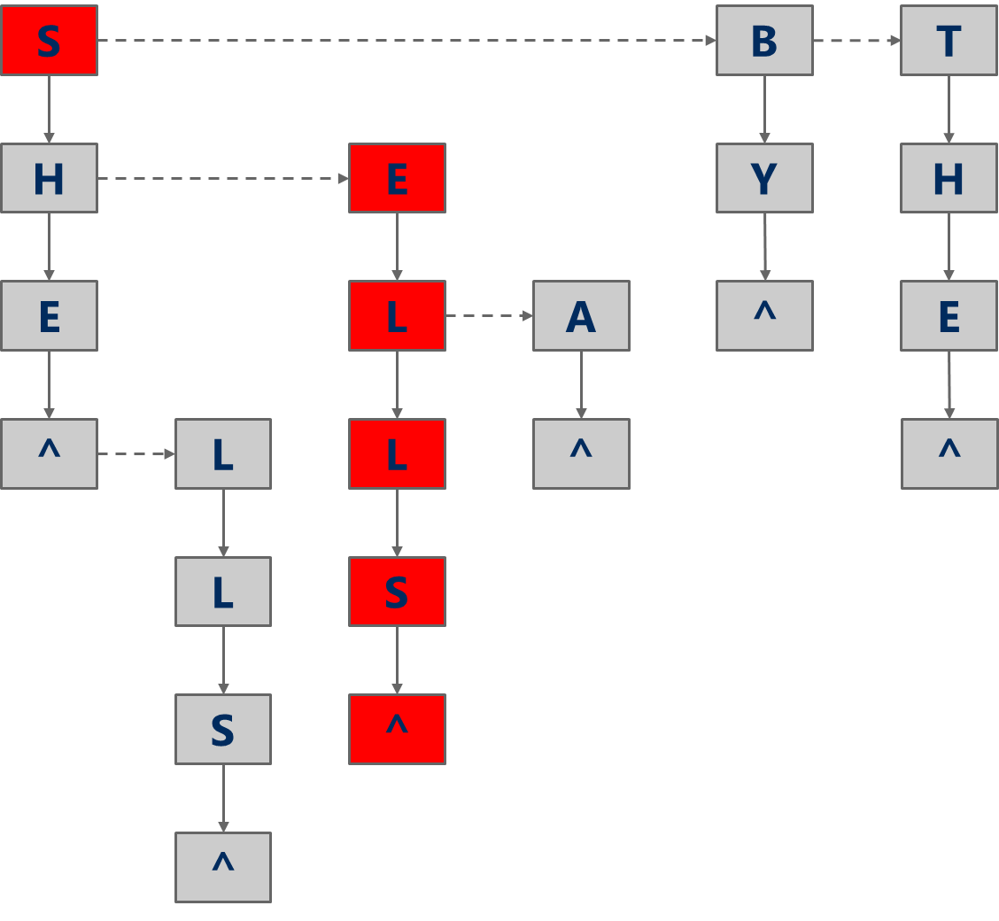

# Week 5: Digital Search, DST, and DLB
Binary Search Tree uses comparison between keys to guide the searching. We saw that Red-Black BSTs are very effective, but they are complex to implement. However in many cases, this can be simplified by using the digital representation of keys for searching. That is, we represent keys as a squence of digits (often bits) or alphabetic characters. Our goal will be to find a simpler method of implementing a self-balancing tree.

## Digital Searching Problem
Recall the Searching Problem. If we have:
+ a large *dynamic* set of data items in the form of `(key, value)` pairs
+ input size($n$) for the number of pairs
We want to see if the *target key($k$)* exists in the set or not. If the key is not found, we can return `NULL`, `false`, or some other value to signify that key was not found.

But now we will form the **Digital Searching Problem** by adding that each key has $b$ bits or $w$ characters (from the alphabet). In ASCII characters, each char has 8 bits which means that $w = \frac{1}{8}b$.

## Digital Search Tree
Using this information we can solve the Digital Searching Problem by using a Digital Search Tree(DST).

Instead of looking at less than/greater than, lets go left or right based on the bits of the key. So, we again have 4 options:
1. current node is `null`, `k` not found
2. `k` is equal to the current node's key, `k` is found, return corresponding value
3. current bit of `k` is `0`, continue to left child
4. current bit of `k` is `1`, continue to right child
Notice that we are not comparing the values, but instead moving based on the bits.

Example: Insert 4(`0100`), 3(`0010`), 2(`0010`), 6(`0110`), and 5(`0101`)
In a DST, each node shares a common prefix with all nodes in its subtree. For example, 6(`0110`) share the prefix `01` with 5. Also, because values aren't compared when adding, in-order traversal doesn't produce a sorted order of the items. However, it is possible to modify the insertion algorithm to make a DST a BST at the same time.

Additionally, when deleting an element of a DST, we can simply replace the element we want with any element in its subtrees. There aren't cases to consider like the BST. This is allowed because all the elements in a subtree share a common prefix with the root of the subtree.

Furthermore, DSTs can handle variable length keys. That inserting 1(`01`) and 6(`0110`) is possible. Since 1 must be in the same place as 6 in the tree above, we will replace 6 by 1, and re-insert 6.

#### Analysis of Digital Search Trees
The DST's runtime is $O(b)$, where $b:=\text{bit length of the target or inserted key}$. On average $b=\log(n)$ if we assume `0`s and `1`s are equally likely. Thus, on average runtime would be $O(\log(n))$. In general, $b \geq \lceil\log(n)\rceil$. 
	Note that the average case runtime can be calculated using this formula: $$\text{Average Case Runtime}=\sum_{\text{All Cases}}{P(\text{Case}_i)}\times{\text{Runtime for Case}_i}$$ where $P(\text{Case}):=\text{Probability of that case}$.
The DST is more simple to implement than a RB-BST, and since we are not comparing key values, we can use equality comparisons against the full key (which is better than `compareTo()` in BST).

## Radix Search Trie
Although DSTs are great, we can in fact make our self-balancing tree much simpler using a **Radix Search Trie**. The *trie* comes from re*trie*ve and is pronounced as "*try*". In a RST, we store the keys implicitly as paths down the tree instead of storing them inside nodes in the tree. Unlike DSTs, the interior nodes of the trie do not store values. They exists simply to direct us according to the bitstring of the key. The values are instead only at the leaf nodes(end of key's bitstring path). By doing this, an RST uses less space than BST or DST. A key difference between tries and trees are that tries do not store the key in the node whereas trees do.

### Adding to RST
Given a key and a corresponding value, adding to an RST is rather simple. 
```PSEUDOCODE
if (root == null) root = new Node(key, value);
Else 
{
	current_node = root;
	for (each bit in key)
	{
		if (bit == 0)
		{
			if(current_node.leftChild == null)current_node.leftChild = new Node(k, v);
			else move to left child
		}
		if (bit == 1)
		{
			if(current_node.rightChild == null)current_node.rightChild = new Node(k, v);
			else move to right child
		}
	}
}
```
### Searching a RST
Conversely, searching in a RST to simple too. Given a key:
```PSEUDOCODE
currNode = root;
for (each bit in key)
{
	if(currNode ==null) return notFound;
	if (bit == 0)
	{
		move to left child
	}
	if (bit == 1)
	{
		move to right child
	}
}
if(currNode ==null) return notFound;
else return currNode.value;
```


However, to store entries with variables key lengths, we may need to store values in the interior nodes. An RST also has the benefit of allowing us to search for prefixes. That is, we can search whether there is an entry with prefix `010` by traversing down to `010` and seeing if we've reached a `null`. If we haven't met a `null` there is an entry with that prefix.

Radix Search Tries are implemented using simple `BinaryTree`s which utilizes the `BinaryNode`s with `left`, `right`, `data` fields.

### Analysis Radix Search Trie
When we are searching, we must always traverse to the end of the bitstring. That means we get an runtime of $O(b)$, the bit length of the key. However, we are not doing any key comparisons when we traverse.

An RST can work with non-integer keys. For example, if we have a key of `char`s, we can treat them the same way as 8-bit integers (assuming ASCII). 

Generally, DST and RST are efficient in checking if a target key is a prefix of any of the keys in the tree. DSTs are preferred over BSTs when bits of keys are randomly distributed (i.e., the probability of each bit being zero is 0.5) The DST will be balanced in this case without having to use the more complicated Red-Black BST. RSTs are preferred over BSTs when bit lengths of keys are close to $\log (n)$. The RST will be balanced in this case without having to use the more complicated Red-Black BST. However, note that the DST and RST don’t provide the extra operations (e.g., predecessor and successor) provided by BST.


## R-way RST
However, if we have a key of `String`s, we may have huge bit lengths which may make our search very slow. To overcome this, we can consider a character at a time instead of bits in a string. That means instead of 2 children per node, we will have upto $r$ children where $r$ is the alphabet size. This is called an **R-way Radix Search Tries** or *Multi-way Radix Search Tries*.

### Adding to R-way RST
```PSEUDOCODE
if (root == null) root = new Node(k,v);
currNode = root;
for (each char c in key)
{
	find cth child
	if (child is null) create new node and attatch as child
	move to child
}
if (at last char of key) insert value to currNode
```
### Analysis of R-way Radix Search Trie
Note that each node can have at most 26 children. So the runtime would be $O(w)$ where $w$ is the character length of the string. This is a major improvement for RSTs with string keys because $w < b$ which reduces the height of the tree. Also $w=\lceil\frac{b}{\log{R}}\rceil$ where $R$ is the alphabet size, which means for a binary RST $h=\log_2(n)$ where for R-way RST $h=\log_R{(n)}$. In the case of a search miss, we require an average of $\log_R(n)$ nodes to be examined. Thus, our search miss time is decreased significantly. For example, if we consider a tree with $2^{20}$ keys, an Binary RST yields a height of $\log_2{2^{20}}=20$ whereas an 8-bit R-way RST yields $\log_{256}{2^{20}}=2.5$. 

Note since $R$ can vary, in implementing an R-way RST, we can use an array of nodes (size $R$) to holds references to the children.
| Implementation | Insert | Search Hit | Search Miss |
|-----------------|---------|-------------|-----------|
|Binary RST| $\theta(b)$ | $\theta(b)$ | $\theta(\log_2{n})$ *on average*|
|Multi-way RST| $\theta(w)$|$\theta(w)$|$\log_R(n)$|


### Drawbacks of RST
Considering 8-bit ASCII, each node contains $2^8$ references. This is especially problematic as in many cases, a lot of this space is unused and wasted. For example, if many keys share a prefix—such as all keys begin with `key`—the 25 nodes of the first 3 nodes will be unused. At the lower level however, most keys have probably separated out and refence lists will be sparse

## De La Briandais Tries (DLB)
To get over this draw back, we can replace the array inside the node of R-way trie with linked-list.

### Adding to DLB
```PSEUDOCODE
current node = root;
if (root is null) set root to new node
for (each character c in the key)
{
	look up c in the linked list with current as first node
	if (not found)  create new node and attatch to linked list
	if (found) move to the child of the found node
	if (at last character of key) insert value into current node and return
}
```
There are two alternative implementation to DLBs:
1. If search terminates on a node with non-null value, key is found; otherwise key is not found
```Java
private class DLBNode
{
	private Object val;
	private T character;
	private Node sibling;
	private Node child;
}
```
2. If we append a sentinel char (`^`) to each key before add and search. If search encounters a `null`, key is not found; otherwise key is found
```Java
private class DLBNode
{
	private T character;
	private Node sibling;
	private Node child;
}
```

### Analysis of DLB
So how does the DLB compare to R-way tries? Recognize that we still have to go through all the letters ($w$), but now we may need to traverse all characters of the linked list($R$) which is in linear time. Therefore we have $\theta(w\cdot R)$ for insertion. The DLB is slower asymptotically than the R-way RST (which uses an array with constant access time), however we are saving space by using linked list (we don't need to hold references for characters we do not use).

So if we know that the set of keys are going to be dense (that is key spans all characters), using an R-way RST will be beneficial. Conversely, if the key is not dense (that is many share a common prefix), using a DLB will help us save space.


## Runtime Comparison for Search Trees/Tries
| Implementation    | Runtime for Search Hit | Runtime for Search Miss (Average) | Runtime for Insert    |
|:-----------------:|:----------------------:|:---------------------------------:|:---------------------:|
| BST               | $\theta(n)$            | $\theta(\log n)$                  | $\theta(n)$           |
| RB-BST            | $\theta(\log n)$       | $\theta(\log n)$                  | $\theta(\log n)$      |
| DST               | $\theta(b)$            | $\theta(\log n)$                  | $\theta(b)$           |
| RST               | $\theta(b)$            | $\theta(\log n)$                  | $\theta(b)$           |
| R-way RST         | $\theta(w)$            | $\theta(\log_R n)$                | $\theta(w)$           |
| DLB               | $\theta(w\cdot R)$     | $\theta(\log_R n \cdot R)$        | $\theta(w\cdot R)$    |


