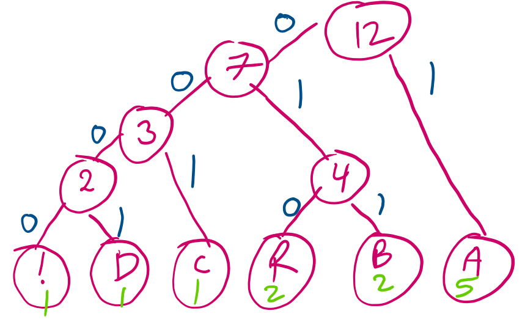
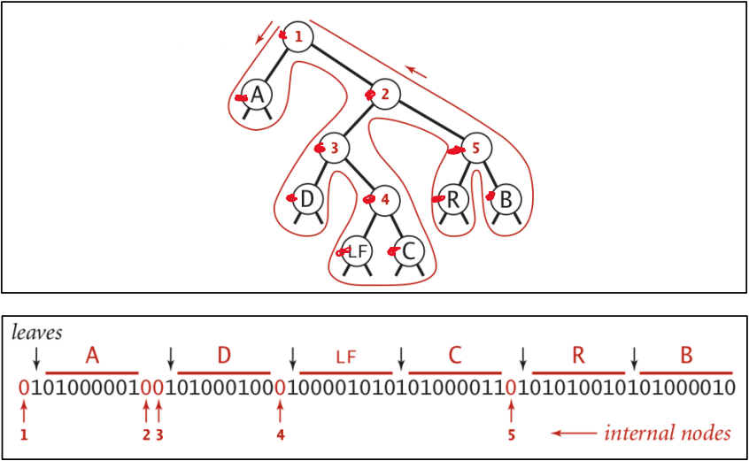

# Week 6: Compression
## Compression Problem
We have thus far focused our studies on the searching problem. But now let's take a look at another common problem in computer science: **Compression**. Here, given a file containing a sequence of characters ($n$ character, each encoded as an 8-bit extended ASCII, with total file size $8\times n$). We want to find a shorter bitstring (with length $< 8n$) such that the original sequence can be fully restored from the bitstring.

### Aside: ASCII Encoding
ASCII Encoding is a table which maps a set of $R$ symbols to fixed-size encoding of length $k$ bits assuming $2^k \geq R$ (or $k = \lceil \log R \rceil$).
### Lossy Compression
In **Lossy Compression**, information is permanently lost in the compression process (E.g. MP3 H264 JPEG). This is typically fine in audio/video files as humans might not be able to perceive the difference. $$D \to \text{Compress}\to C\to \text{Expand}\to D'$$
For example, An MP3 might *cut out* portions of audio that are considered beyond what most people are capable of hearing. A JPEG might reduce the quality of the picture by cutting out the subtle difference in the shade of colors.
### Lossless Compression
In **Lossless Compression**, the input can be recovered from the compressed data exactly (E.g. zip files, FLAC). $$ D \to \text{Compress} \to C$$$$ C \to \text{Expand} \to D$$
#### Lossless Compression Framework
* For Compression
	* For each **code block** in the input file, we convert it to a *codeword*
* For Expansion
	* For each **codeword** in the compressed file, we convert it back to a *code block*

##### Case 1: Fixed-size code blocks & Fixed-size codewords
To achieve compression, codeword size has to be less than code block size. This can be done if the used alphabet in the file is smaller than the Extended ASCII. For example, if a file only contains letters in the English alphabet, we can use `5` bits per codeword instead of `8` bits. I.e., the **compression ratio** is $\frac{5}{8}$. Another example may be a file that contains 64-encoded characters(lower-case, upper-case English letters, digits, and two symbols). For this, we can use `6` bits per codeword. Typically, the reduced alphabet is stored at the beginning of the compressed file, however this increases the compressed file size and the compression ratio.
##### Case 2: Fixed-size code blocks & Variable-size codewords
To achieve compression, we assign shorted codewords to more frequently occuring characters. Given:
+ $R:=\text{Alphabet Size}$
+ $f_i:=\text{frequency of the character }i$
+ $\text{|codeword|}_i:= \text{bitlength of codeword corresponding to character }i$
The compressed file size will be: $$\sum_{i=1}^R{f_i\ \text{codeword}_i}$$We will see that the Huffman compression is an example of this case.

##### Case 3: Variable-size code blocks & Fixed-size codewords
To achieve compression, we find recurring patterns that are as long as possible in the input file and assign fixed-size codewords to each. We will see later that the *LZW Compression* and *Run-length Encoding* are examples of this case. 

##### Case 5: Variable-size code blocks & Variable-size codewords
This is typically implemented as Case 3 amd then applying Case 2 on the output.

## Huffman Compression
What if we used a *variable-length* codewords instead of the constant 8 bits per character? Could we store the same info in less space?

In Huffman Compression, different characters are represented using codes of different bit lengths. Consider the characters, R, S, T, L, N, E. In English, these characters are used more frequently than say Q or X. Using this knowledge, we can achieve compression by using fewer bits to represent more common characters, and using longer code to represent less common characters. 

However, we also have to be careful because our expansion must restore the data identically. Notice that decoding was easy for block codes. We grab the next 8 bits in the bitstring, and decode. However, how can we decode a bitstring that is made of variable length code words? We can try adding delimiters, but that adds to our compressed file, reduces the compression ratio, and is not idea. Instead, we can make the codes **prefix-free**. That is, no code can be a prefix of any other in the scheme.

### Generating Prefix-free Codes with Huffmman Encoding
We can create these prefix-free codes with **Huffman Encoding**. Given a sequence of $n$ characters, we want to find a codeword$h_i$ for each character $i$ such that no codeword is a prefix of any other. When each character in the input sequence is replaced with each codeword:
* The length of the compressed sequence is minimum (compared to other fixed-size code-block encoding schemes)
* The original sequence can be fully restored from the compressed bitstring.

Assuming we have $K$ characters that are used in the file to be compressed and each has a weight(frequency), we will create a forest, $F$,  of $K$ single-node trees, one for each character, with the single node storing that char's weight.
```PSEUDOCODE
while (|F| > 1)
{
	Select T1, T2 in F that have the smallest weights in F
	Create a new tree node N whose weight is the sum of T1 and T2's weights
	Add T1 and T2 as children of N
	Remove T1 and T2 from F
	Add new tree rooted by N to F
}
```

#### Example: Building a Tree for `ABRACADABRA!`


Here we get the codes:
| char | codeword |
|------|----------|
|A|`1`|
|B|`011`|
|C|`001`|
|D|`0001`|
|R|`010`|
|!|`0000`|
Using these codewords, we can compress ABRACADABRA! to `1 011 010 1 001 1 0001 1 011 010 1 0000`. Notice that we are now using `28` bits which is significantly less than the original size ($12 \times 8 =98$bits). Therefore, byusing Huffman Encoding, we are able to achieve a compression ratio of $\frac{28}{96}$.

### Implementing Huffman Compression
In implementing the Huffman Compression Algorithm, we need to efficiently select the lowest weight trees to merge when constructing the trie. We can accomplish this using a *priority queue*, which we will see later. Also, we need to be able to read/write bitstrings. However, unless we pick multiples of 8 bits for our codewords, we will need to read/write *fractions* of bytes for our codewords. This is difficult and we won't actually do I/O on fraction of bytes. Instead, we'll maintain a buffer of bytes and perform bit processing on this buffer (See `BinaryStdIn.java` and `BinaryStdOut.java`).

#### Reading/Writing Individual Bits: Binary I/O
```Java
private static void writeBit(boolean bit) {
	// add bit to buffer by shifting in a zero
	buffer <<= 1;
	if (bit) buffer |= 1; //then turning it to one if needed
	// if buffer is full (8 bits), write out as a single byte
	N++;
	if (N == 8) clearBuffer()
}
```
We can use `writeBit(true)` or `writeBit(false)` to write zeros and 1s.

#### Using a SymbolTable, but Storing it in a Linear Fashion
Additionally, to encode we'll need to read in characters and output codes. Conversely, we need to read in codes and output characters to decode. This will require us to use a symbol table (When encoding we will use char as key, codeword as value; and when decoding vice versa.  So which of the SymbolTableADT should we choose?

When we are encoding, we are looking at one character at a time, so a simple array would work (considering the character as an integer index). When we are decoding, we are lookng at one bit at a time, so it's best to use the DST or Tries.

However, this means that we must store the trie in the compressed file, so we can use it to decode later on. How do we convert a tree-like structure into a linear file (serialize the tree)?

We can use preorder traversal with modifications. As we are traversing, if we are at an internal node we return 0, if we are at a leaf, we return 1 followed by ASCII code of char inside.

```Java
private static void writeTrie(Node x){
	if (x.isLeaf()) {
		BinaryStdOut.write(true); // output 1 using Binary Output
		BinaryStdOut.write(x.ch); // output ASCII code of char
		return;
	}
	BinaryStdOut.write(false); // output 0 in internal node
	writeTrie(x.left);
	writeTrie(x.right);
}

private static Node readTrie() {
	if (BinaryStdIn.readBoolean())
		return new Node(BinaryStdIn.readChar(), 0, null, null);
	return new Node('\0', 0, readTrie(), readTrie());
}
```

#### Huffman Pseudocode
```PSEUDOCODE
Encode
{
	Read Input
	Computer Frequencies
	Build trie/codeword table
	Write out trie as a bitstring to compressed file
	Write out character count of input
		- This is necessary because our codeword might not be a multiple of 8.
	Use table to write out the codeword for each input character
}
Decode
{
	Read trie
	Read character count
	Use trie to decode bitstring of compressed file
}
```

### Generating the *Codebook*
The table of codewords indexed by a character is called a **codebook**. That is `codebook['a']` returns the codeword of `a`. This is a simple array implementation where the character is treated as an integer (which acts as an index of the array).
```Java
void generateCodeBook(Node root, StringBuilder codeword)
{
	if(root.isLeaf()){
		codebook[root.data]=codeword.toString();
	}
	if(root.left != null){
		codeword.append(0);
		generateCodeBook(root.left, codeword);
		pop(last char in codeword);
	}
	if(root.right != null){
		codeword.append(1);
		generateCodeBook(root.right, codeword);
		pop(last char in codeword);
	}
}
```

### Decoding
```PSEUDOCODE
curr = root;
while (curr != leaf)
{
	move down tree according to bit pattern
}
if (the node is a leaf) output the respective character
reset curr to root;
move on to the next bitstring
```

### Determining Character Frequency
#### Option 1: Preprocess the file to be Compressed
We can go through the file and count how many times the character appears. This will ensure that Huffman’s algorithm will produce the best output for the given file. However, this requires two passes over the input, one to analyze frequencies/build the trie/build the code lookup table, and
another to compress the file. Trie must be stored with the compressed file, reducing the quality
of the compression. This especially hurts small files (we might end up increasing the filesize) as generally, large files are more amenable to Huffman compression (Just because a file is large, however, does not mean that it will
compress well!).

#### Option 2: Use a static trie
Instead of analyzing the file at hand, we analyze multiple sample files, build a single tree that will be used for all compressions/expansions. This saves on trie storage overhead, but in general not a very good approach. Different character frequency characteristics of different files means that a code set/trie that works well for one file could work very poorly for another (could even cause an increase in file size after “compression”).

#### Option 3: Adaptive Huffman Coding
How about we pass over the data one time to construct the codes and compress a file with no background knowledge of the source distribution? This is a bit more complicated, but it works. We won't focus too much on how it works in this class.

### Analysis of Huffman Compression
Recall that ASCII requires $8n$ bits to store $n$ characters. For a file containing $c$ different characters, after the compressions, we had the codes $\{h_0,h_1,h_2,...h_{c-1} \}$  and frequencies $\{f_0, f_1, f_2, …, f_{(c-1)}\}$. The total size of the compressed file will be $\sum_0^{(c-1)}{|h_i|\times\ f_i}$.

Notice that total size depends heavily on the frequency. The bigger the difference in frequencies, the better the potential for compression. Also, we know that Huffman is optimal for character-by-character prefix-free encodings(Proof in Prop. T & U in Text 5.5). If all characters in the alphabet have the same usage frequency, we can’t beat block code (fixed-size codewords), and Huffman reduces to fixed-size codewords on a character by character basis.

## Run Length Encoding
However, Huffman can fall short when we have repeated patterns of multiple characters. Consider the following text file which contains 1000 of every ASCII character:
```File
AAAAAA......
BBBBBB......
...
1000 of every ASCII char
```
Since all characters have the same frequencies, Huffman would not be able to do better than assigning 8 bits per char as in ASCII. That is, Huffman encoding will not actually compress this file.

However, there is a clear pattern in the file, and it seems that it should be compressible. Could we represent the string as `1000A1000B1000C...`? Assuming we use 10 bits to represent the number of repeats, and 8 bits for the char, only `4608` bits are needed to store **run length encoded** file. That's a large saving compared to the original size of `2048000` bits. This is very useful for Image compression where RGB values are often repeated patterns. However, notice that this is incredible compression performance is based on a very specific scenario. In generaly, run length encoding is not  effective for most files, as they often lack long runs of repeated characters.

## LZW Compression
Recall that Huffman used variable-length codewords to represent fixed-length portions of the input. Instead, let's try another approach that uses fixed-length codewords to represent variable-length portions of the input. The idea is that the more characters can be represented by a single codeword, the better the compression will be.

Consider the word "*the*" takes up 24 bits in ASCII. Representing "*the*" with the single 12 bit codeword cuts the used space in half. Similarly, representing longer strings with a 12 bit codeword
would mean even better savings!

But how do we know that *"the"* will bein our file? We need to avoid avoid the same problems as the use of a static trie for Huffman encoding. Therfore, we need to use an adaptive algorithm and build up our patterns and codewords as we go through the file.

```PSEUDOCODE
init codebook to all single chars (E.g., chars maps to its ASCII value)
// codewords 0 to 255 are filled now

while (!EOF) // EOF = End Of File
{
	Find the longest match in codebook
	Output codeword of that match
	Take this longest match + next char in file
		& add to codebook
	Start from char right after the match
}
```

### Example: Compress `TOBEORNOTTOBEORTOBEORNOT` using 12 bits codewords.
Assuming that we've initialized the codebook with ASCII values (0-255 filled).
| Cur | Output | Add |
|-----|--------|-----|
|T|84|TO:256|
|O|79|OB:257|
|B|66|BE:258|
|E|69|EO:259|
|O|79|OR:260|
|R|82|RN:261|
|N|78|NO:262|
|O|79|OT:263|
|T|84|TT:264|
|TO|256|TOB:265|
|BE|257|BEO:266|
|OR|260|ORT:267|
|TOB|265|TOBE:268|
|EO|259|EOR:269|
|RN|261|RNO:270|
|OT|263| -- |

### LZW Expansion
```PSEUDOCODE
init codebook to all single chars (E.g., charp maps to its ASCII value)
// codewords 0 to 255 are filled now
while (!EOF)
{
	Read next codeword from file	
	Lookup corresponding pattern in the codebook
	Output that pattern
	Add the previous pattern + the first character of the current pattern to codebook
}
the codebook
```
Note that since we are adding the previous pattern after we outpit, we cannot add after the first output
#### Example: Expand `84 79 66 69 79 82 78 79 84 256 257 260 265 259 261 263`
| Cur | Output | Add      |
|--------|-----|----------|
| 84     | T   | --       |
| 79     | O   | 256:TO   |
| 66     | B   | 257:OB   |
| 69     | E   | 258:BE   |
| 79     | O   | 259:EO   |
| 82     | R   | 260:OR   |
| 78     | N   | 261:RN   |
| 79     | O   | 262:NO   |
| 84     | T   | 263:OT   |
| 256    | TO  | 264:TT   |
| 257    | BE  | 265:TOB  |
| 260    | OR  | 266:BEO  |
| 265    | TOB | 267:ORT  |
| 259    | EO  | 268:TOBE |
| 261    | RN  | 269:EOR  |
| 263    | OT  | 270:RNO  |

Notice that both compression and expansion construct the same codebook. That is, compression stores character string to get the codeword, while expansion stores the codeword, to get the character string. Since they contain the same pairs in the same order, we do not need to store the codebook with the compressed file, which saves space.

However, notice that expansion is sometimes one step ahead of compression. If, during the compression, the (pattern, codeword) that was just added to the table is immediately used in the next step, the decompression algorithm will not yet know the codeword. This is easily detected and dealt with, however

#### LZW Expansion Corner Case
During Compress(`AAAAAA`)
|Cur|Output|Add|
|---|-------|----|
|A|65|AA:256|
|AA|256|AAA:257|
|AAA|257|---|

During Expansion(`65 256 257`)
|Cur|Output|Add|
|-|-|-|
|65|A| --|
|256|??? ($x$)|??? ($x$)|

We want: 
|Cur|Output|Add|
|-|-|-|
|65|A| --|
|256|AA|256:AA|
|257|AAA|257:AAA|

To get $x$, we can use some algebraic logic. We know that since `256` does not appear on the codebook, it must have been added at the exact previous step (of compression). That means, the expansion will add $x$ at the current step. Recognize that $x$ will be the previous pattern + first char of $x$. Since the previous pattern is $A$, and the first char of $x$ is the char that was compressed in the previous step, $x=AA$. 

Practically, in such a corner case, $x$ = previous pattern + first character of previous pattern.

### Implementing LZW
How can we represent and store the codebook (during compression and expansion)? We can determine the best choice by considering what operations we need, and how many times it will be performed. For the expansion, a simple array will suffice. However, for the compression, we are looking for the longest match and then adding to the codebook. A trie will be a perfect choice for that.

How long should the codewords be? If we use fewer bits, we get better compression earlier on, but we will have less codewords availible, which will hamper compression for larger files. If we use more bits, it would delay actual compression until longer patterns are found due to the larger codeword size, however, more codewords cam be made which means greater compression gains in the long term.

We can have adaptive code words. For example, we start with 9 bit codewords, when all 512 codewords is used, we switch to outputting 10 bit code words, then to 11 bits, and so on. That means, in the codebook, we will see a series of 9 bit codewords, then a series of 10 bits code words, and so.

What about the size of the codebook? We must consider the possiblity that we run out of codewords (there are only $2^n$ possible codewords for $n$ bits codes). Even using variable width codewords, they can't be arbitrarily large. 

There are two options to deal with this. When we run out of code words we can:
1. Stop adding new keywords, use the codebook as is. This maintains long already established patterns, but if the file changes, it will not be compressed as effectively.
2. Throw out the codebook and start over from single characters. This allows new patterns tobe compressed, but until new patterns are built up, compression will be minimal.

## Shannon's Entropy w/ Information Theory
Can we reason about how much a file can be compressed? This is possible by using Shannon's Entropy.

Information Theory was founded by Claude Shannon in his paper *"A Mathematical Theory of Communication"*.  In it he defined **Entropy**, a key measure in Information theory which measures the unpredictability of information content. 

Entropy can be calculated by using the formula: $$H(c)=-1 \times \log_2{\text{Pr}(c)}$$
+ Pr(c) is the probability of character c
+ Pr(c) = 0.5, then H(c)=1bit
+ Pr(c)=0.25. then H(c)=2 bits

On average, a lossless compression scheme cannot compress a message to have more than 1 bit of entropy per bit of compressed message. By losslessly compressing data, we represent the same information in less space. That is entropy of 8 bits of compressed data > entropy of 8 bits of uncompressed data.

How can we measure the entorpy of a file? We can sum each unique character c and multiply it by the probability. $$H(\text{file})=\sum_{\text{each unique char c}}H(c)\times\text{Pr}(c)$$
The probability of each character in the file $\text{Pr}(c)$ can be determined by $\text{Pr}(c)=\frac{f(c)}{\text{file size}}$. However, it may also depend on receiver and sender contexts and tehir world knowledge.

Also, we can also apply the concept of entropy to lanague:
+ Translating a language to binary, we can calculate the average number of bits required to store a letter of the language.
+ $\text{Entropy of a Language} \times \text{Length of message} = \text{Amount of Information contained in that message}$
+ Uncompressed, English has between 0.6 and 1.3 bits of entropy per letter.

## Huffman v. LZW
In general, LZW provides better compression than Huffman, because very long patterns can be built up, leadning to better compression. Also, it provides better compression of archived directories of files (`.tar`). This is because different files don't hurt each other as they did in Huffman (cf. static tries).

In real life, `gif`s and `pdf`s use LZW compression, but in most other cases they use dedicated compression algorithm:
* DEFLATE (combination of LZ77 and Huffman) - Used by PKZIP and gzip
* Burrows-Wheeler transforms - Used by bzip2
* LZMA - Used by 7-zip
* brotli -Introduced by Google in Sept. 2015
	* Based around a " … combination of a modern variant of the LZ77 algorithm, Huffman coding[,] and 2nd order context modeling … 
There is no universal compression algorithm because no algorithm can compress every bitstream. If such an algorithm existed, we can use to compress its own output. And we could keep compressing its output until our compressed file is 0 bits! Clearly this can’t work. (Proofs in Proposition S of Section 5.5 of the text).

Can we algorithmically find the best algorithm for a given file? No and this problem is undeciable. For example, a Fibonacci sequence of one billion numbers can be compressed by a program to generate Fibonacci numbers. 
