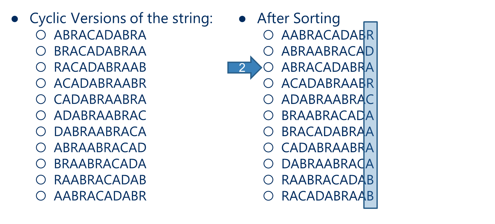

## Burrows-Wheeler Data Compression Algorithm
Currently, the best comrpession algorithm (in terms of compression ratio) for text is the **Burrows-Wheeler Data Compression Algorithm** which is also used in UNIX's bzip2.

### Compression Algorithm
There are three steps:
1. Cluster same letters as close to each other as possible
	+ Burrows-Wheeler Transform
2. Move-To-Front Encoding
	+ Convert output of previous step into an integer file with large frequency differences
3. Huffman Compression
	+ Compress the file of integers using Huffman
### Expansion Algorithm
Apply the inverse of compression steps in reverse order
+ Huffman decoding
+ Move-To-Front decoding
+ Inverse Burrows-Wheeler Transform

### Move-To-Front Encoding
Goal: Given a text file in which series of the same letter occur near each other many times, convert it into a text file in which small integers appear more frequently than large ones.

We begin by initializing an ordered list of the 256 ASCII characters. In this case, extended ASCII character $i$ appears $i$th in the list. For each character $c$ from input, we output the index in the list where $c$ appears, then move $c$ to the front of the list

Example:
`a b b b a a b b b b a c c a b b a a a b c`
is given by the sequence of integers:
`97 98 0 0 1 0 1 0 0 0 1 99 0 1 2 0 1 0 0 1 2`
Note that '`a`' is `97` in ASCII and that we have printed out the indices as type int with separating whitespace.

The idea of MTF Encoding is that, in the output of MTF Encoding, smaller integers have higher frequencies than larger integers.

### Move-To-Front Decoding
```PSEUDOCODE
Initialize an ordered list of 256 characters
// same as encoding
For each integer i (i is between 0 and 255) 
	print the ith character in the list
	move that character to the front of the list
```

### Burrows-Wheeler Transform
The **Burrows-Wheeler Transform** rearranges the characters in the input, such that lots of clusters with repeated characters while still being possible to recover the original input.

```PSEUDOCODE
For each block of length N
	generate N strings by cycling the characters of the block one step at a time
	sort the strings
	output is the last column in the sorted table and the index of the original block in the sorted array
```

Consider the string `ABRACADABRA`. Clearly, $N=11$

Notice that in the cyclic version of the string, the first character of a string is the last character of the next string. How we have many clusters with many repeated characters.

However, Burrows-Wheeler has draw backs. First, we must process blocks of input file. Recall that LZW can processes the input one character at a time. This means the larger the block size, the better the compression. However, this also means the sorting time is longer.

## Repetitive Minimum Problem
Given an input of a large dynamic set of data items, we wish to repeatledly find a minium item. We want to find a solution that repeats this problem (such as selection sort, or Huffman tree construction). Note that between the repeats, our data set can change.

## Priority Queue ADT
To solve this problem, we will create a new ADT, the **Priority Queue ADT**. We will generalize min and max to highest priority. Our ADT will have the following operations:
+ Insert
+ Find item with highest priority (`findMin()`, `findMax()`)
+ Remove an item with highest priority (`removeMin()`, `removeMax()`)
Also recall that we mentioned using Priority Queues in Huffman tries.

So how can we implement these operations? The simplest approach is the array.

### Unsorted Array PQ
Insertion adds new item to the end of the array and occurs at $\theta(1)$.
Find must search for the highest priority item (min or max) and runs at $\theta(n)$.
Remove must also search for the highest priority item and runs at $\theta(n)$.

### Sorted Array PQ
Insertion adds new item at the approporiate location occurs at $\theta(n)$.
Find returns item at end of array $\theta(1)$.
Remove returns and delte the item at end of the array $\theta(1)$.

### Balanced BST PQ
Insertion: $\theta(\log n)$
Find: $\theta(\log n)$
Remove: $\theta(\log n)$
Notice all operations are $\theta(\log n)$, meaning we do not hjave any constant time operations.

### Amoritzed Time
So which implementation should we choose? That depends on the application. However, we can compre the ***amortized runtime*** of each implementation. That is given a set of operations performed by the application: $$\text{Amortized Time}=\frac{\text{Total runtime of a sequence of operations}}{\text{Number of operations}}$$
#### Example: Huffman Trie Construction
In Huffman Trie Construction, for each of the $K-1$ iterations (where $K$ is the unique number of characters in the file to be compressed), we have 2 calls to `removeMin()` and 1 call to `insert()`.

**Unsorted Array**: $\text{Total time for Huffman Trie Construction} = (K-1)\times (2K+1\times 1)=O(K^2)$
**Sorted Array: **$\text{Total time for Huffman Trie Construction} = (K-1)\times (2\times 1+1\times K)=O(K^2)$
**Balanced BST: **$\text{Total time for Huffman Trie Construction} = (K-1)\times (2\times \log K+1\times \log K)=O(K\log K)$

## The Heap
The **Heap** is a complete binary tree such that for each node `T` in the tree, `T.item` is a higher priority than `T.right_child.item` and `T.left_child.item` (This is called the **Heap Property**). It is much simpler than a regular balanced tree because the relation between left and right child do not matter.

Finding in the Heap is easy; We simply return the root of the tree ($\theta(1)$). However, remove and insert are not quite trivial. The tree must be modified and the heap property must be maintained.

### Heap Insert
To Insert, we add a new node at the next available leaf. Then, we must push the node up the tree unti it is supporting the heap property.

### Heap Remove
To Remove the root, we can try to overwrite the root with the item from the last leaf and delete the last leaf. But this could create a violation in the heap property, which means we must now push the root down the tree until it is supporting the heap property.

For Insert and Remove, since the height of the complete binary tree is $\log(n)$, meaning at most, uphead and down heap operations traverse the height of the tree. Hence, insert and remove are $\theta(\log n)$.


<< mUst watch last lecture>>